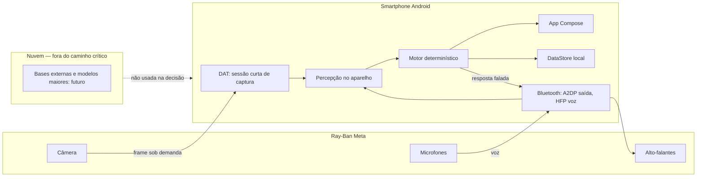
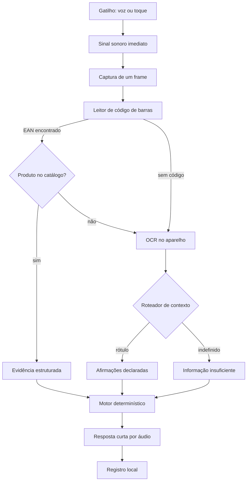
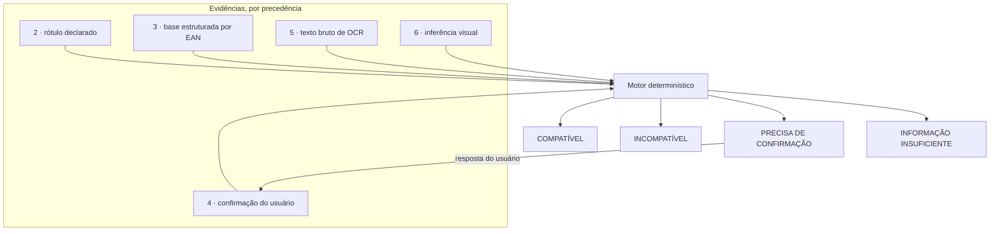
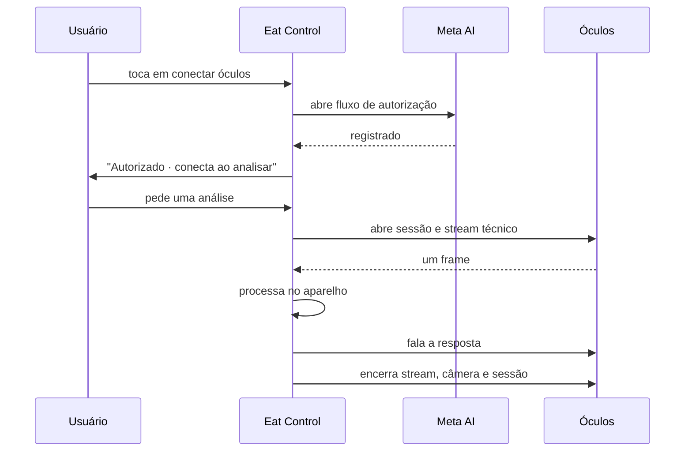
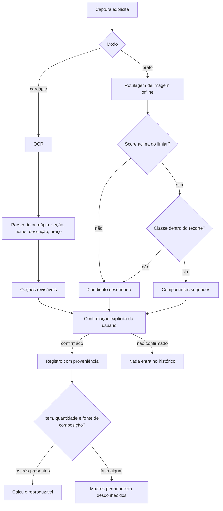
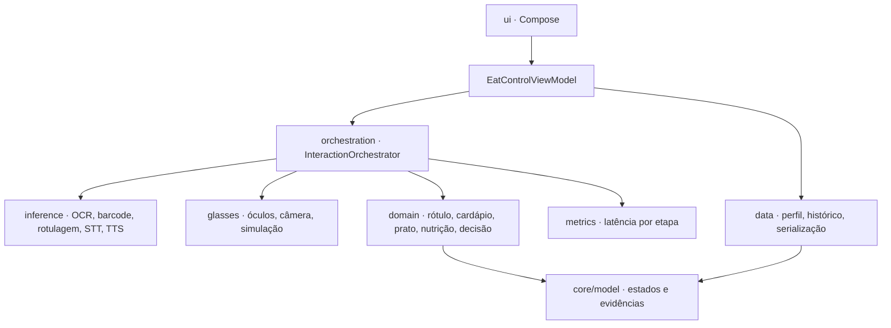

# Diagramas de arquitetura — Eat Control AI

Versão: 1.0
Data: 18/08/2026
Formato: Mermaid

> Google Docs não renderiza Mermaid. Para incluir no documento final, cole o código em
> [mermaid.live](https://mermaid.live), exporte PNG ou SVG e insira a imagem.

## 1. Fronteiras: óculos, smartphone e nuvem

A nuvem aparece tracejada de propósito: nenhuma etapa da decisão depende dela.

## 2. Cascata automática por custo

O OCR só é pago quando o caminho mais barato não resolve.

## 3. Hierarquia de evidência e estados

Inferência visual entra por último e nunca prova ausência de ingrediente.

## 4. Ciclo de vida da sessão dos óculos

O encerramento roda em bloco `finally`: falha na análise não deixa a sessão aberta.

## 5. Fluxos assistidos: cardápio e prato

Este é o guardrail central do produto: sem os três elementos, não existe número.

## 6. Camadas de código

`domain`, `core/model` e `data` são Kotlin sem dependência de Android, e é por isso que a cobertura
alta se concentra ali.
