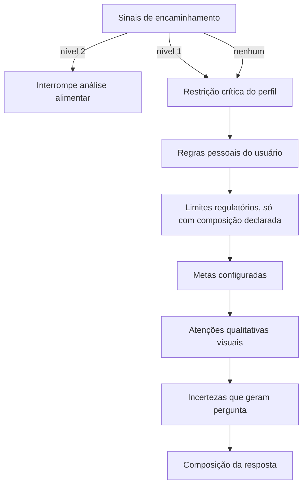

# Rule pack GLP-1 — especificação v1

Identificador: `glp1-rules-v1`
Estado: `IMPLEMENTADO NO DOMÍNIO`, `NÃO LIGADO À INTERFACE`, `NÃO ATIVADO COMO CONTEÚDO VALIDADO`
Base de validação: [`VALIDACAO_CLINICA_2026-08-18.md`](VALIDACAO_CLINICA_2026-08-18.md) (`VAL-GLP1-R1`)
Data: 18/08/2026

> Ativação como conteúdo clínico validado depende do registro formal pendente no item 12 do registro
> de validação. Até lá, o pack roda com `underReview = true` e toda resposta declara **regra em
> revisão**.

## 0. Estado da implementação

| Camada | Arquivo | Estado |
|---|---|---|
| Modelo, contexto e contrato | `domain/glp1/Glp1Model.kt` | `IMPLEMENTADO` |
| Léxico proibido | `domain/glp1/ForbiddenLexicon.kt` | `IMPLEMENTADO` |
| Composição da resposta | `domain/glp1/Glp1MessageComposer.kt` | `IMPLEMENTADO` |
| R1 a R6 | `domain/glp1/Glp1RulePackV1.kt` | `IMPLEMENTADO` |
| Testes | `test/domain/glp1/*` | 43 testes aprovados; 98,8% de linhas e 85,6% de ramos |
| Ligação com orquestrador e interface | — | `PENDENTE` |
| Persistência de regra pessoal e sintoma | — | `PENDENTE` |
| Alertas baseados em histórico | — | `PENDENTE` |

Decisão de modelagem: em vez de criar um tipo paralelo `NutritionEvidence`, a proveniência ficou em
`Finding.origin` (um `EvidenceType` já existente) e a base numérica continua em `NutrientAmount`, que
já carrega nutriente, valor, base e trecho de origem. Um tipo novo duplicaria esses campos sem
acrescentar informação.

## 1. Contrato

```text
Entrada:
  observação da refeição   componentes identificados, proveniência, confiança
  nutrição declarada       por porção e por 100 g/ml, quando existir
  porções confirmadas      número informado pelo usuário
  perfil                   restrições, metas configuradas, plano cadastrado
  regras pessoais          itens a evitar ou observar, criados pelo usuário
  histórico                consumo do dia, desconforto relatado, tendências

Saída:
  achados                  lista com tipo, propriedade, origem, confiança
  perguntas                confirmações necessárias
  nível de encaminhamento  NENHUM | PROFISSIONAL | AVALIACAO_MEDICA
  mensagem curta           para áudio, até 15 palavras
  detalhe                  para tela, com origem de cada achado
  versão do pack           string exibida na resposta
```

Regra invariante: **nenhum achado existe sem origem**. Cada item carrega se veio de rótulo declarado,
base estruturada, confirmação do usuário, texto de OCR ou identificação visual.

## 2. Precedência de evidência, revisada

| Precedência | Origem | Pode afirmar presença | Pode afirmar ausência |
|---|---|---|---|
| 1 | encaminhamento clínico | não se aplica | não se aplica |
| 2 | rótulo declarado | sim | sim |
| 3 | base estruturada por EAN | sim | sim |
| 4 | confirmação do usuário | sim | sim |
| 5 | texto de OCR sem estrutura | sim, com ressalva | não |
| 6 | identificação visual | sim, para item visível, com incerteza | **nunca** |

Mudança em relação à versão anterior: a identificação visual passa a sustentar afirmação de
**presença de item visível** e a gerar análise. Continua proibida de afirmar ausência, ingrediente
oculto, receita ou alergênico.

## 3. Ordem de avaliação

A ordem existe para que o resultado nunca soterre o que é mais importante.



## 4. Grupos de regra

### R1 — Limites regulatórios objetivos

Aplicáveis **somente** quando existe composição declarada por 100 g ou 100 ml, de alimento embalado.

| Propriedade | Sólidos | Líquidos | Achado |
|---|---|---|---|
| Açúcar adicionado | ≥ 15 g/100 g | ≥ 7,5 g/100 ml | `ALTO_EM_ACUCAR_ADICIONADO` |
| Gordura saturada | ≥ 6 g/100 g | ≥ 3 g/100 ml | `ALTO_EM_GORDURA_SATURADA` |
| Sódio | ≥ 600 mg/100 g | ≥ 300 mg/100 ml | `ALTO_EM_SODIO` |

Guardas obrigatórias:

- se a base declarada for apenas por porção, converter só quando a massa da porção estiver declarada;
- se não houver base por 100 g nem massa da porção, **não emitir o achado**;
- nunca aplicar a estimativa visual de prato;
- o texto deve deixar claro que o critério é de rotulagem, não um veredito individual.

### R2 — Metas configuradas

Sem meta configurada, o app informa consumo e não julga.

| Regra | Condição | Achado |
|---|---|---|
| Falta para a meta | meta existe e consumo confirmado < meta | `META_RESTANTE` |
| Meta excedida | consumo confirmado > meta | `META_EXCEDIDA` |
| Limite pessoal excedido | limite configurado para nutriente ultrapassado | `LIMITE_CONFIGURADO_EXCEDIDO` |

A meta nunca é calculada pelo app. Ela é registrada com `definedBy`: usuário, profissional ou plano.

Para proteína, a resposta inclui a ressalva obrigatória de que preservação muscular também envolve
exercício de força, quando a mensagem mencionar meta de proteína.

### R3 — Atenções qualitativas

Derivadas de identificação visual ou de texto de cardápio. Não recebem limite numérico.

| Sinal observado | Achado | Origem aceitável |
|---|---|---|
| Fritura | `PREPARO_FRITURA` | visual ou termo escrito |
| Molho cremoso | `MOLHO_CREMOSO` | visual ou termo escrito |
| Refeição aparentemente volumosa | `VOLUME_ELEVADO` | visual, **somente** comparando com a porção do plano cadastrado |
| Presença de vegetais | `VEGETAIS_PRESENTES` | visual |
| Presença de fonte proteica | `PROTEINA_PRESENTE` | visual |

`VOLUME_ELEVADO` sem plano cadastrado vira descrição, não atenção: o app diz o que vê e não afirma que
está grande demais.

### R4 — Regras pessoais

Criadas pelo usuário, inclusive a partir de desconforto relatado.

```text
RegraPessoal {
  alvo        item ou categoria, por exemplo "derivados de leite"
  ação        EVITAR | OBSERVAR
  origem      DESCONFORTO_RELATADO | PREFERENCIA | ORIENTACAO_PROFISSIONAL
  criadaEm    data
  nota        texto do usuário, preservado
}
```

Comportamento:

- item identificado com correspondência direta gera atenção citando a regra do usuário;
- item apenas **possivelmente** relacionado gera pergunta, não afirmação;
- a regra pessoal nunca cria meta clínica nem limite numérico;
- quando o número de exclusões cresce a ponto de restringir grupos alimentares inteiros, o app
  escalona para o nível 1 de encaminhamento.

Exemplos aprovados:

> "Atenção: identifiquei queijo nesta refeição. Você cadastrou preferência por evitar derivados de leite."

> "Esse molho pode conter derivados de leite. Quer confirmar os ingredientes antes de consumir?"

### R5 — Incerteza que gera pergunta

Dispara quando: confiança visual baixa, ingrediente oculto plausível, componente fora do recorte,
quantidade desconhecida ou conflito entre fontes.

Resposta padrão: "Não consigo confirmar isso apenas pela imagem. Quer me dizer os ingredientes?"

Alternativa oferecida: ler o rótulo ou a descrição do item, quando existir.

### R6 — Encaminhamento

| Nível | Gatilhos | Efeito |
|---|---|---|
| `PROFISSIONAL` | sintomas gastrointestinais recorrentes; perda de peso muito acelerada; dificuldade frequente de comer ou atingir metas; suspeita de perda de massa muscular; múltiplas restrições; gravidez; comorbidade renal, gastrointestinal ou relevante; histórico de transtorno alimentar; dúvida sobre suplemento, medicamento ou dose | mantém a análise e acrescenta orientação de confirmar com o profissional |
| `AVALIACAO_MEDICA` | dor abdominal intensa ou persistente; vômitos repetidos; incapacidade de manter líquidos; sinais importantes de desidratação; reação alérgica relevante | **interrompe** a análise alimentar e orienta avaliação médica |

Os gatilhos vêm de registro explícito do usuário ou de histórico, nunca de inferência automática de
sintoma a partir de imagem.

## 5. Composição da resposta

Padrão aprovado: **identificar, contextualizar, orientar**.

```text
[identificação]  o que foi reconhecido e de onde veio
[contexto]       como se relaciona com plano, metas, regras pessoais e histórico
[orientação]     ponto de atenção, pergunta ou encaminhamento
```

Limite para áudio: até 15 palavras na frase principal. O detalhe fica na tela.

Exemplos válidos:

> "Boa presença de proteína e vegetais. Fritura e molho cremoso são os pontos de atenção."

> "Faltam aproximadamente 25 gramas para sua meta de proteína hoje."

> "Essa refeição ultrapassa o limite de sódio configurado no seu perfil."

> "Esse ponto depende da sua condição individual. Confirme com seu profissional."

## 6. Léxico proibido

Bloqueio obrigatório, verificado por teste automatizado sobre todo texto gerado:

`seguro` · `diagnóstico` · `evita sintomas` · `vai causar` · `não vai causar` · `garantido` ·
`sem risco` · `cura` · `trata` · `previne` · `indicado` · `contraindicado` · `proibido` · `liberado` ·
`ideal para quem usa GLP-1` · `isso preserva músculo` · `evita perda muscular` · qualquer menção a
dose, ajuste ou nome de medicamento.

Substituições aprovadas: "pode ser um ponto de atenção", "está acima da sua meta cadastrada", "pode
ter menor tolerância", "considere confirmar com seu profissional".

## 7. Regras que continuam fora da v1

- limite numérico para volume ou porção;
- meta de hidratação com valor padrão;
- densidade nutricional como índice;
- grau de processamento inferido por imagem;
- qualquer cálculo de meta a partir de peso corporal;
- atribuição de causa a um alimento específico para um sintoma.

## 8. Matriz de teste exigida antes da ativação

Coberta por `RegulatoryLabelRulesTest`, `Glp1RulePackTest` e `Glp1MessageComposerTest`.

| Caso | Esperado |
|---|---|
| Rótulo com 700 mg de sódio por 100 g | `ALTO_EM_SODIO` citando critério de rotulagem |
| Rótulo apenas por porção, sem massa declarada | nenhum achado regulatório |
| Prato com molho cremoso visível | atenção qualitativa, sem alegação sobre leite |
| Prato com molho e regra pessoal de leite | pergunta de confirmação, não afirmação |
| Queijo identificado com regra pessoal de leite | atenção citando a regra do usuário |
| Meta de proteína configurada e consumo parcial | `META_RESTANTE` com ressalva de exercício |
| Sem meta configurada | consumo informado sem julgamento |
| Candidato visual com confiança baixa | pergunta, sem achado |
| Usuário relata vômitos repetidos | `AVALIACAO_MEDICA` e interrupção da análise |
| Usuário relata desconforto após refeição com leite | oferta de criar regra pessoal |
| Oito exclusões cadastradas | escalonamento para `PROFISSIONAL` |
| Qualquer saída gerada | nenhuma palavra do léxico proibido |

## 9. Versionamento e exibição

- toda resposta que usar o pack exibe `glp1-rules-v1`;
- alterar limite, mensagem ou gatilho exige nova versão e nova aprovação registrada;
- o registro de validação correspondente fica citado no resultado técnico;
- enquanto o registro formal estiver pendente, a interface indica **regra em revisão**.

## 10. Implementação sugerida

| Etapa | Escopo | Estado |
|---|---|---|
| 1 | Proveniência por achado, reaproveitando `EvidenceType` e `NutrientAmount` | `IMPLEMENTADO` |
| 2 | `RulePack` como interface versionada, com `evaluate(contexto): Glp1Assessment` | `IMPLEMENTADO` |
| 3 | R1 e R2, determinísticos e verificáveis por teste puro | `IMPLEMENTADO` |
| 4 | R3 e R5, ligadas à identificação visual e ao cardápio | `IMPLEMENTADO` |
| 5 | `PersonalRule` no domínio, com correspondência direta e possível | `IMPLEMENTADO` |
| 6 | R6 a partir de sintoma relatado explicitamente | `IMPLEMENTADO` |
| 7 | Composição de mensagem e teste de léxico proibido | `IMPLEMENTADO` |
| 8 | Persistência local de regra pessoal e sintoma | `PENDENTE` |
| 9 | Ligação com orquestrador, interface e voz | `PENDENTE` |
| 10 | Alertas de histórico, como proteína abaixo da meta em dias recentes | `PENDENTE` |

As etapas 8 a 10 introduzem dados novos de saúde no aparelho e precisam manter a política atual:
armazenamento local, sem backup em nuvem e com exclusão pelo usuário.
